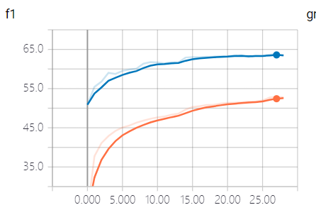

## SLQA

Multi-Granularity Hierarchical Attention Fusion Networks
for Reading Comprehension and Question Answering    

If anyone would love to test the performance on SQuAD, please tell me the final score. 
You just need to change the coca_reader.py to read in dataset of SQuAD.  

Paper: [http://www.aclweb.org/anthology/P18-1158](http://www.aclweb.org/anthology/P18-1158)  
Allennlp:[https://github.com/allenai/allennlp](https://github.com/allenai/allennlp)  

### Tutorial

First you should install `allennlp` and make sure you have downloaded the `elmo` and `glove`. You will find the version information in `config/seperate_slqa.json`. You could also use `elmo` by url, please turn to allennlp tutorials for help.  
`mkdir elmo`  
`mkdir glove`  
Then for train, run:  
`allennlp train config/seperate_slqa.json -s output_dir --include-package coca-qa`  
To modified the parameters for the model, you can see `config/seperate_slqa.json`. I recommend you to learn how to use `allennlp`. It's very easy and useful.

### update:
- Rewrite the model using allennlp. It seems that it would run successfully. I'm waiting for the performance. 
- Add simple flow layer and the config file is slqa_h.json in package config.

### update 12.6:
- It seems that the performance is not good enough.

### update 12.7:  
- The `text_field_embedder` receives a list of `token embedder`s and concatenates their output in an arbitrary order. So if we use `split` we can't make sure the part with dimension of 1024 is the output of `elmo_token_embedder`. As a result, I split it as three seperate `text_field_embedder`s.
- The fuse function in the paper is wrote as the same one. But I think the fuse layers of passage, question and self-aligned passage representation use different weight and they should not share gradients. So I use three different fuse layers.
- Change the self attention function from `D = AA^T` to `D = AWA^T`

### update 12.9:  
I think this version will be the final. Since I don't know how to reach the performance mentioned in paper where it's good than bidaf with self-attention and elmo.  The final F1 score on CoQA is 61.879 where bidaf++ can reach 65.  Besides, I didn't use any previous questions and answers. May be the performance with historical information is good enough but I have no time to test now.

### update 12.10:
F1 score while training:

### TODO:  
- Try to have a better performance.
- Add more manual features.
- Test performance with previous information.
- Test performance on SQuAD1.1.
